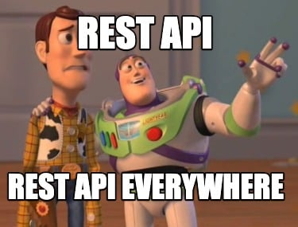

# API REST Flask con Docker
​
Ejemplo de API REST hecha con Python, Flask y Docker.

- Para obtener todos los usuarios:
    - `GET http://localhost:5000/user/all`
​
- Para obtener un usuario por nombre:
    - `GET http://localhost:5000/user?name=guilledevelawyer`

- Para crear un usuario:
    - `POST http://localhost:5000/user`

Body:
```javascript 
{
  "name": "miguel",
  "email": "nievas@gmail.com"
}
```

- Para borrar un usuario:
    - `DELETE http://localhost:5000/user`

Body:
```javascript 
{
"email": "malaga@gmail.com",
"name":"albertomalaga"
}
```

- Para editar un usuario:
    - `POST http://localhost:5000/user`

Body:
```javascript 
{
"email": "alejandruregex@gmail.com",
"name":"alejandruregex",
"new_email":"alejandro.reyes@gmail.com",
"new_name":"alejandroreyes"
}
```

## A jugar!
 